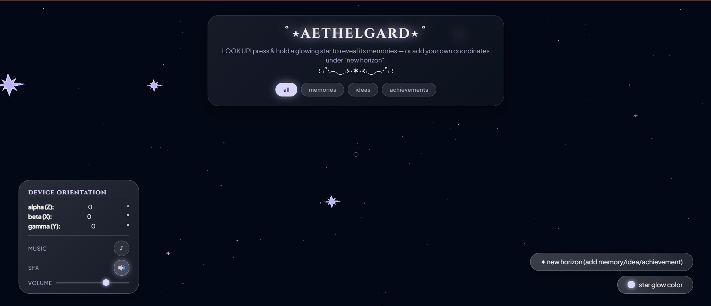
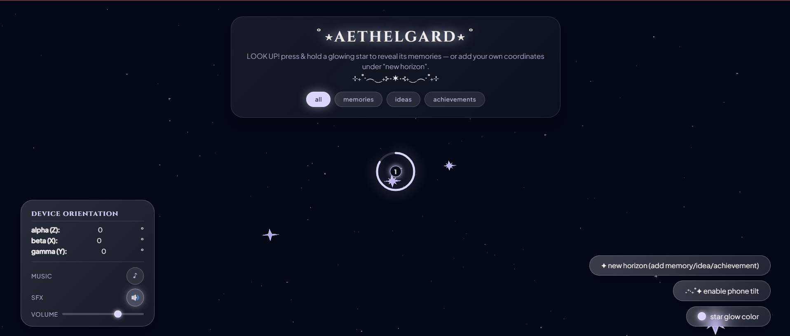
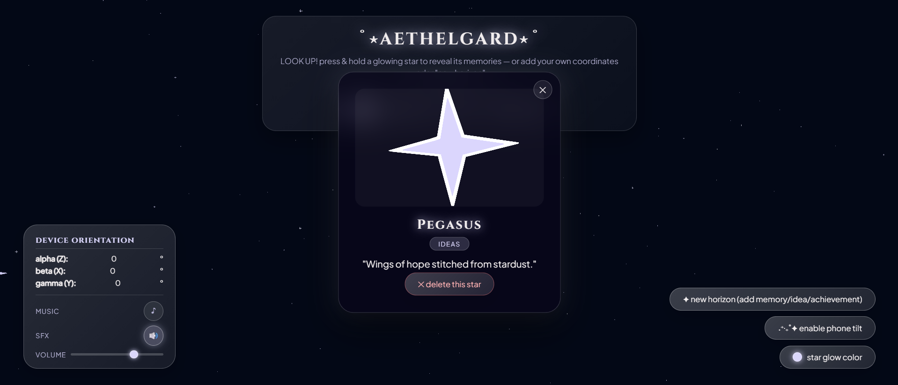
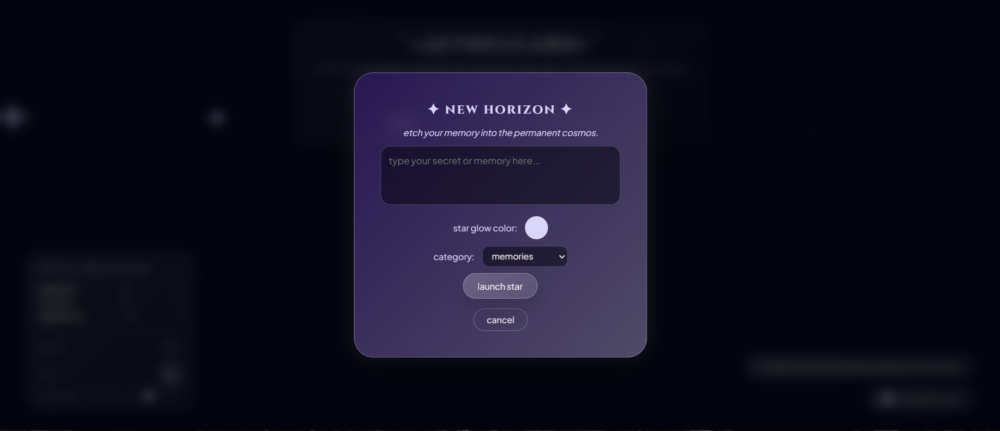

# 𐙚AETHELGARD⊹ ࣪ ˖

heyyy there! this is aethelgard, a timecapsule web-app that lets u save ur memories, ideas and the achievements ur the most proud of (lol) in a sky full of stars :)

₊˚ ✧ ━━━━ ꒰ঌ ⊱ ·✦· ⊰ ໒꒱ ━━━━ ✧ ₊˚

## ✧ about the project °❀.ೃ࿔*
our theme for the project was: "a comet only becomes legend because someone looked up"

based on that prompt we developed an app that requires u to look up (or around in general) to see great things that happened in ur life (like good memories u dont want to forget for instance). at the same time we wanted to keep that space/sky theme soooo yeahhh <3

₊˚ ✧ ━━━━ ꒰ঌ ⊱ ·✦· ⊰ ໒꒱ ━━━━ ✧ ₊˚

## how the app works  𑣲⋆｡˚ ⟡˖ ࣪
when u first open the app u immediately encounter the main screen... here u see the stars where ur ideas etc can be stored u can filter them by categories... below is a button add a new star so idea etc and one to activate the phone tilt option because some browsers/device may require u confirming that u allow it first... when u create a new star u can edit its category and its glow color, which u can also add in general with the last of the buttons at the bottom right :3
on the bottom left u can view ur coordinates (only on phone version tho) and edit stuff like the music and sound volume or whether they are allowed to be played at all

ohh and to view the stars u have to press on the bigger ones (they actually contain smth) and hold for 3 seconds (ull see a countdown) and then u can see the content and delete the star if u feel the need to do so

₊˚ ✧ ━━━━ ꒰ঌ ⊱ ·✦· ⊰ ໒꒱ ━━━━ ✧ ₊˚

## screenshots: 

₊˚ ✧ ━━━━ ꒰ঌ ⊱ ·✦· ⊰ ໒꒱ ━━━━ ✧ ₊˚

## 🛠 tech stack ｡𖦹°꩜.ೃ࿔
* html5
* css3
* javascript
* github pages for hosting

₊˚ ✧ ━━━━ ꒰ঌ ⊱ ·✦· ⊰ ໒꒱ ━━━━ ✧ ₊˚

## features were the most proud of lol
* the 3d/gyroscopic environment of the sky
* how cool it feels to use the app with a phone
* how customizable it is
* the overall look of the app hehe esp the bg ofc and the glassy look

₊˚ ✧ ━━━━ ꒰ঌ ⊱ ·✦· ⊰ ໒꒱ ━━━━ ✧ ₊˚

## problems that occured while coding ⋆｡˚𑣲⋆｡˚
* really making the environtment gyroscopic and like feel like ur looking at a sky instead of it randomly rotating the view for instance lol
* choosing a style we truly liked
* making the stars twinkle

₊˚ ✧ ━━━━ ꒰ঌ ⊱ ·✦· ⊰ ໒꒱ ━━━━ ✧ ₊˚

## AI disclosure ⋆✴︎˚｡⋆
we used ai mainly for planning, debugging but also to improve/refine our code in the end of the process and to learn how to implement things (like three.js for example) that we have never used before.

₊˚ ✧ ━━━━ ꒰ঌ ⊱ ·✦· ⊰ ໒꒱ ━━━━ ✧ ₊˚

## setup instructions ⋅°❀⋆.ೃ࿔*:･
* download or clone this repo
* open the index.html file in ur browser or editor by double clicking it (while keeping the folder structure as it is)
* anddddd ur good to go (the web-app should open in ur browser or built-in viewer)

₊˚ ✧ ━━━━ ꒰ঌ ⊱ ·✦· ⊰ ໒꒱ ━━━━ ✧ ₊˚

## setup instructions ⋅°❀⋆.ೃ࿔*:･
* download or clone this repo
* open the index.html file in ur browser or editor by double clicking it (while keeping the folder structure as it is)
* anddddd ur good to go (the web-app should open in ur browser or built-in viewer)

₊˚ ✧ ━━━━ ꒰ঌ ⊱ ·✦· ⊰ ໒꒱ ━━━━ ✧ ₊˚

## ₊˚⊹ ࿔ how to visit
u can now check out the live online version here: **https://daliisalm22.github.io/aethelgard/**

₊˚ ✧ ━━━━ ꒰ঌ ⊱ ·✦· ⊰ ໒꒱ ━━━━ ✧ ₊˚

## we hope u enjoy using the app!! ⋆𐙚₊˚⊹♡
